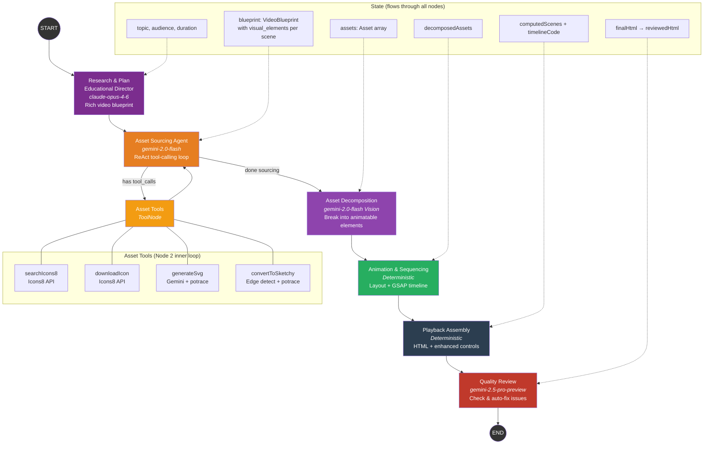

# Multi-Agent LangGraph Workflow — Implementation Plan v3

## Context
Multi-agent LangGraph StateGraph pipeline for generating professional whiteboard explainer videos (VideoScribe/Doodly style). Each pipeline stage is a graph node with agentic capabilities, structured state, and checkpointing. The old sequential pipeline remains available via `npm run pipeline`.

---

## Architecture (6 Nodes)

```
START
  → research_plan              (Claude Opus: comprehensive video blueprint)
  → asset_agent ⇄ asset_tools  (ReAct loop: Icons8 + Gemini SVG gen + sketchy conversion)
  → asset_decomposition        (Gemini: decompose complex assets into animatable elements)
  → animation                  (Deterministic: layout computation + GSAP timeline)
  → playback                   (Deterministic: HTML assembly + enhanced controls)
  → quality_review             (Gemini Pro: review HTML for issues, output fixes)
  → END
```

### Mermaid Graph Diagram



---

## Model Configuration

All models are centralized in `scripts/langgraph/config.mjs`:

| Node | Model | Purpose |
|------|-------|---------|
| Research & Plan | `claude-opus-4-6` | Best reasoning for content planning |
| Asset Sourcing | `gemini-3.1-flash-lite-preview` | Fast ReAct tool-calling loop |
| Asset Decomposition | `gemini-3.1-flash-lite-preview` | Vision analysis of SVG assets |
| Quality Review | `gemini-3.1-pro-preview` | Strong model for code review |

### Auto-Generated Graph (via `--render`)


See also: [`langgraph-workflow.mmd`](langgraph-workflow.mmd) (Mermaid source)

---

## File Structure

```
scripts/langgraph/
├── index.mjs                                — CLI entry point + LangSmith setup
├── graph.mjs                                — StateGraph definition + edges
├── state.mjs                                — Annotation state schema
├── config.mjs                               — Centralized models, keys, settings
├── nodes/
│   ├── research-plan-educational-director.mjs — Node 1: Claude Opus → rich blueprint
│   ├── asset-sourcing.mjs                   — Node 2: ReAct agent (Icons8 + Gemini SVG)
│   ├── asset-decomposition.mjs              — Node 3: Gemini Vision decomposition
│   ├── animation.mjs                        — Node 4: Deterministic layout + GSAP
│   ├── playback.mjs                         — Node 5: HTML assembly
│   └── quality-review.mjs                   — Node 6: Gemini Pro review
├── tools/
│   ├── icons8.mjs                           — Icons8 search + download tools
│   ├── svg-generator.mjs                    — Gemini image gen + potrace
│   └── svg-to-rough.mjs                     — Edge detection + potrace conversion
├── prompts/
│   ├── research-plan.mjs                    — Rich blueprint prompt + JSON schema
│   ├── asset-sourcing.mjs                   — ReAct agent system prompt
│   ├── asset-decomposition.mjs              — Vision decomposition prompt + schema
│   └── quality-review.mjs                   — Quality review prompt + schema
└── lib/
    ├── gemini-client.mjs                    — @google/genai SDK wrapper
    └── asset-store.mjs                      — Global asset store (avoids context overflow)
```

---

## Key Decisions

| Decision | Choice | Rationale |
|----------|--------|-----------|
| Research model | `claude-opus-4-6` via `@anthropic-ai/claude-agent-sdk` | Best reasoning for content design |
| Asset model | `gemini-3.1-flash-lite-preview` via `@langchain/google` | Fast tool-calling for ReAct loop |
| Quality model | `gemini-3.1-pro-preview` | Strong code review capabilities |
| Scene count | Dynamic (agent decides) | Agent determines optimal count from content complexity |
| Scene design | Multiple visual_elements per scene | Rich, infographic-style scenes |
| Video style | VideoScribe/Doodly | Professional whiteboard animation |
| Config | Centralized `config.mjs` | Single source of truth for models, keys, paths |
| Tracing | LangSmith integration | Observability for debugging pipeline runs |
| Old pipeline | Kept intact | `npm run langgraph` (new) / `npm run pipeline` (old) |
| Checkpointing | MemorySaver | Resume from failure |
| Asset storage | Global side-channel store | Prevents LLM context overflow from heavy SVG/PNG data |

---

## NPM Dependencies

```bash
npm install @langchain/google @langchain/core @langchain/langgraph zod \
            @anthropic-ai/claude-agent-sdk langsmith @google/genai
```

Existing deps reused: `sharp`, `potrace`, `svg2roughjs`, `@playwright/test`

---

## Scene Blueprint Format (v3)

Each scene now supports multiple visual elements:

```json
{
  "scene_number": 1,
  "title": "How Habits Form",
  "key_concept": "Habits are neural pathways...",
  "visual_elements": [
    {
      "id": "ve_1_main",
      "type": "main_illustration",
      "description": "brain with glowing neural pathways, side view",
      "position": { "x": 560, "y": 60, "width": 660, "height": 580 },
      "source_preference": "gemini_generate",
      "complexity": "complex"
    },
    {
      "id": "ve_1_icon_loop",
      "type": "supporting_icon",
      "description": "circular arrow loop icon",
      "position": { "x": 80, "y": 400, "width": 100, "height": 100 },
      "source_preference": "icons8",
      "icon_search_terms": ["loop", "cycle", "repeat"]
    }
  ],
  "labels": [
    { "text": "Cue", "position": { "x": 620, "y": 180 }, "arrow_to": { "x": 700, "y": 200 } },
    { "text": "Routine", "position": { "x": 800, "y": 350 }, "arrow_to": { "x": 750, "y": 400 } }
  ],
  "decorations": [
    { "type": "box", "target": "ve_1_main", "roughness": 1.5, "color": "#2b7ec2" }
  ]
}
```

---

## LangSmith Tracing

Set these environment variables in `.env`:

```
LANGSMITH_TRACING=true
LANGSMITH_ENDPOINT=https://api.smith.langchain.com
LANGSMITH_API_KEY=lsv2_pt_...
LANGSMITH_PROJECT=explainer-videos
```

Tracing is auto-configured by `config.mjs` before LangChain modules load.

---

## Environment Variables (`.env`)

```
GEMINI_API_KEY=...
ANTHROPIC_API_KEY=...
LANGSMITH_TRACING=true
LANGSMITH_ENDPOINT=https://api.smith.langchain.com
LANGSMITH_API_KEY=lsv2_pt_...
LANGSMITH_PROJECT=explainer-videos
```

---

## Usage

```bash
# Run with all options
npm run langgraph -- "Forming Good Habits" --duration=60 --audience="General audience"

# Minimal (topic only — agent decides duration and scene count)
npm run langgraph -- "What Are Cells"

# With additional instructions
npm run langgraph -- "Machine Learning" --instructions="Focus on neural networks, include code examples"

# Custom output directory
npm run langgraph -- "What Are Cells" --duration=90 --output=output/biology

# Resume from checkpoint
npm run langgraph -- "What Are Cells" --thread=what-are-cells-1234567890

# Export graph visualization
npm run langgraph -- --render

# Old pipeline (still works)
npm run pipeline "What Are Cells" 60
```

---

## Verification Plan

1. `node scripts/langgraph/index.mjs "What Are Cells" --duration=60`
2. Open generated HTML in browser:
   - Verify all scenes render with rich visual content
   - Test seek bar — scrub to any point, state should be correct
   - Test speed controls (0.5x, 1x, 1.5x, 2x)
   - Test keyboard shortcuts (Space, arrows, R, 1-9)
   - Test scene jump buttons and fullscreen
3. Check that each scene has multiple visual elements
4. Verify LangSmith traces appear in the dashboard
5. Test checkpointing: kill mid-run, re-run with same thread, verify resume
6. Compare output quality with `npm run pipeline "What Are Cells"`
