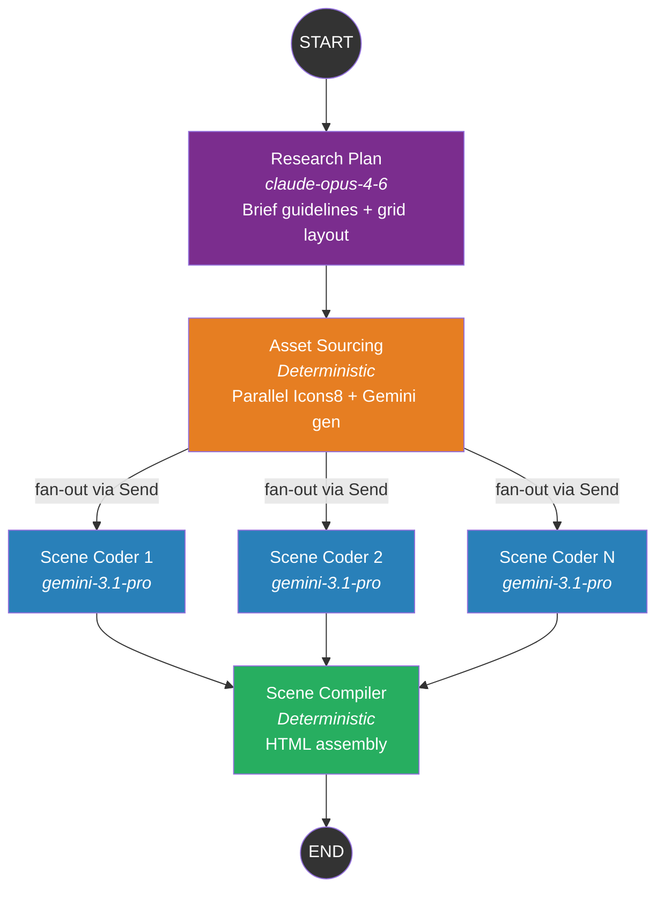
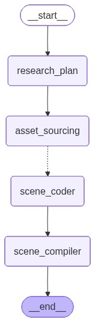

# LangGraph Pipeline v3 — Implementation Plan

## Context
LangGraph StateGraph pipeline for generating professional whiteboard explainer videos (VideoScribe/Doodly style). v3 redesign replaces the 6-node v2 architecture with 4 focused nodes and **parallel scene coding via the LangGraph Send API**. The old sequential pipeline remains available via `npm run pipeline`.

---

## Architecture (4 Nodes)

```
START
  → research_plan           (Claude Opus: brief guidelines with 16×32 grid layout notes)
  → asset_sourcing           (Deterministic: parallel Icons8 search/download + Gemini SVG gen)
  → [scene_coder × N]       (Parallel via Send API: one Gemini Pro instance per scene)
  → scene_compiler           (Deterministic: assembles scenes into runnable HTML)
  → END
```

### Mermaid Graph Diagram



### Auto-Generated Graph (via `--render`)



See also: [`langgraph-workflow.mmd`](langgraph-workflow.mmd) (Mermaid source)

---

## v3 vs v2 — Key Changes

| Aspect | v2 | v3 |
|--------|----|----|
| Node count | 6 nodes | 4 nodes |
| Research output | Verbose JSON with exact pixel coordinates | Brief guidelines with 16×32 grid refs |
| Asset sourcing | ReAct agent loop (slow, LLM decides tools) | Deterministic parallel processing (fast) |
| Scene generation | Deterministic layout templates | LLM-powered per-scene coding (Gemini Pro) |
| Parallelism | Sequential | Parallel scene coding via Send API |
| Quality review | LLM review → regex fixes | Removed (scene coder handles quality directly) |
| Asset decomposition | Gemini Vision decomposes PNGs | Removed (scene coder uses SVGs directly) |

---

## Model Configuration

All models are centralized in `scripts/langgraph/config.mjs`:

| Node | Model | Purpose |
|------|-------|---------|
| Research Plan | `claude-opus-4-6` via `@anthropic-ai/sdk` | Expert research & content planning |
| Scene Coder | `gemini-3.1-pro-preview` via `@google/genai` | SVG layout + timeline generation (parallel) |
| Image Generation | `gemini-3.1-flash-image-preview` via `@google/genai` | Asset sketch generation |

Nodes 2 (Asset Sourcing) and 4 (Scene Compiler) are **deterministic** — no LLM calls.

---

## File Structure

```
scripts/langgraph/
├── index.mjs                      — CLI entry point + LangSmith setup
├── graph.mjs                      — StateGraph with Send API fan-out
├── state.mjs                      — Simplified state schema (concat reducer for scenes)
├── config.mjs                     — Centralized models, keys, settings
├── nodes/
│   ├── research-plan.mjs          — Node 1: Claude Opus → brief guidelines
│   ├── asset-sourcing.mjs         — Node 2: Parallel deterministic asset processing
│   ├── scene-coder.mjs            — Node 3: Gemini Pro per-scene SVG + timeline
│   └── scene-compiler.mjs         — Node 4: Assembles all scenes into final HTML
├── prompts/
│   ├── research-plan-v3.mjs       — Brief guidelines prompt with 16×32 grid system
│   └── scene-coder.mjs            — Scene generation prompt with grid→pixel conversion
├── lib/
│   ├── gemini-client.mjs          — @google/genai SDK wrapper (JSON, image, vision)
│   ├── icons8-api.mjs             — Plain functions: searchIcons8, downloadIconPng
│   ├── svg-pipeline.mjs           — Plain functions: convertPngToSvg, generateImageWithGemini
│   └── asset-store.mjs            — Global asset store (legacy, may not be needed)
├── _archive/                      — v2 nodes (preserved for reference)
│   ├── asset-sourcing-v2.mjs
│   ├── animation-v2.mjs
│   ├── playback-v2.mjs
│   ├── quality-review-v2.mjs
│   ├── asset-decomposition-v2.mjs
│   └── content-research-v2.mjs
└── tools/                         — v2 LangChain tools (unused in v3, kept for reference)
    ├── icons8.mjs
    ├── svg-generator.mjs
    └── svg-to-rough.mjs
```

---

## 16×32 Grid System

The research agent uses a conceptual grid instead of exact pixel coordinates:

- Canvas: 1280×720 (16:9)
- 16 columns × 32 rows
- Column width: 80px, Row height: 22.5px
- Grid references: `"cols 1-8, rows 1-3"` → left half, top strip

The **scene coder** translates grid refs to pixel coordinates:
- `cols A-B` → `x = (A-1)*80`, `width = (B-A+1)*80`
- `rows A-B` → `y = (A-1)*22.5`, `height = (B-A+1)*22.5`

---

## State Schema

```javascript
VideoState = {
  // Inputs
  topic, audience, duration, instructions, slug, outputDir,

  // Node 1 output
  researchNotes: { topic, scenes[], color_palette, total_duration, ... },

  // Node 2 output
  sceneAssets: { 1: [{filename, description, role, dimensions}], 2: [...] },

  // Node 3 output (concat reducer — scenes arrive in parallel)
  sceneOutputs: [{ sceneNumber, svgGroup, clipPaths, timelineSteps, roughShapes }],

  // Node 4 output
  finalHtml, outputPath,

  // Metadata
  errors: [],
}
```

---

## Parallel Scene Coding (Send API)

```javascript
// Fan-out: one scene_coder per scene
function fanOutScenes(state) {
  return state.researchNotes.scenes.map((scene, i) =>
    new Send('scene_coder', { ...state, _sceneIndex: i, _sceneNotes: scene })
  );
}

// Graph wiring
workflow.addConditionalEdges('asset_sourcing', fanOutScenes, ['scene_coder']);
```

Each scene coder receives the full state + scene-specific notes, generates SVG + timeline data, and returns `{ sceneOutputs: [result] }`. The concat reducer in `sceneOutputs` merges all results.

---

## Asset Sourcing (Deterministic)

No ReAct loop — direct code:

1. Read all `assets` from every scene in `researchNotes`
2. For each asset, in parallel (`Promise.all`):
   - If `source_hint === "icon"`: search Icons8 → download PNG → convert to SVG via potrace
   - If `source_hint === "generate"`: call Gemini image gen → edge detect → potrace → SVG
   - Fallback: if Icons8 returns no results, fall back to Gemini generation
3. Save all SVG files to `output/{slug}/assets/`
4. Return `sceneAssets` map keyed by scene number

---

## Output Structure

```
output/{slug}/
├── assets/                        — Source PNGs and converted SVGs
│   ├── scene1_main_gen_src.png
│   ├── scene1_main_gen.svg
│   ├── scene1_supporting_icon_src.png
│   ├── scene1_supporting_icon.svg
│   └── ...
├── scenes/                        — Per-scene SVG + timeline (for editing)
│   ├── scene1.svg
│   ├── scene1.json
│   ├── scene2.svg
│   └── scene2.json
└── {slug}-whiteboard.html         — Final runnable video
```

---

## LangSmith Tracing

Set these environment variables in `.env`:

```
LANGSMITH_TRACING=true
LANGSMITH_ENDPOINT=https://api.smith.langchain.com
LANGSMITH_API_KEY=lsv2_pt_...
LANGSMITH_PROJECT=explainer-videos
```

All LLM calls wrapped with `traceable()` for observability. Parallel scene coding shows overlapping timestamps in LangSmith.

---

## Environment Variables (`.env`)

```
GEMINI_API_KEY=...
ANTHROPIC_API_KEY=...
LANGSMITH_TRACING=true
LANGSMITH_ENDPOINT=https://api.smith.langchain.com
LANGSMITH_API_KEY=lsv2_pt_...
LANGSMITH_PROJECT=explainer-videos
```

---

## Usage

```bash
# Run with all options
npm run langgraph -- "Forming Good Habits" --duration=60 --audience="General audience"

# Minimal (topic only — agent decides duration and scene count)
npm run langgraph -- "What Are Cells"

# With additional instructions
npm run langgraph -- "Machine Learning" --instructions="Focus on neural networks"

# Custom output directory
npm run langgraph -- "What Are Cells" --duration=90 --output=output/biology

# Resume from checkpoint
npm run langgraph -- "What Are Cells" --thread=what-are-cells-1234567890

# Export graph visualization
npm run langgraph -- --render

# Old pipeline (still works)
npm run pipeline "What Are Cells" 60
```

---

## Verification Plan

1. Run: `npm run langgraph -- "Forming Good Habits" --duration=60 --audience="General audience"`
2. Check `output/forming-good-habits/assets/` for SVG files (should see Icons8 + Gemini mix)
3. Check `output/forming-good-habits/scenes/` for per-scene SVG + JSON
4. Open `output/forming-good-habits/forming-good-habits-whiteboard.html` in browser
5. Verify: scenes render, animations play, seek bar works, all assets visible
6. Check LangSmith: all 4 node types visible with inputs/outputs/tokens/cost
7. Verify parallel execution: scene coding should show overlapping timestamps
